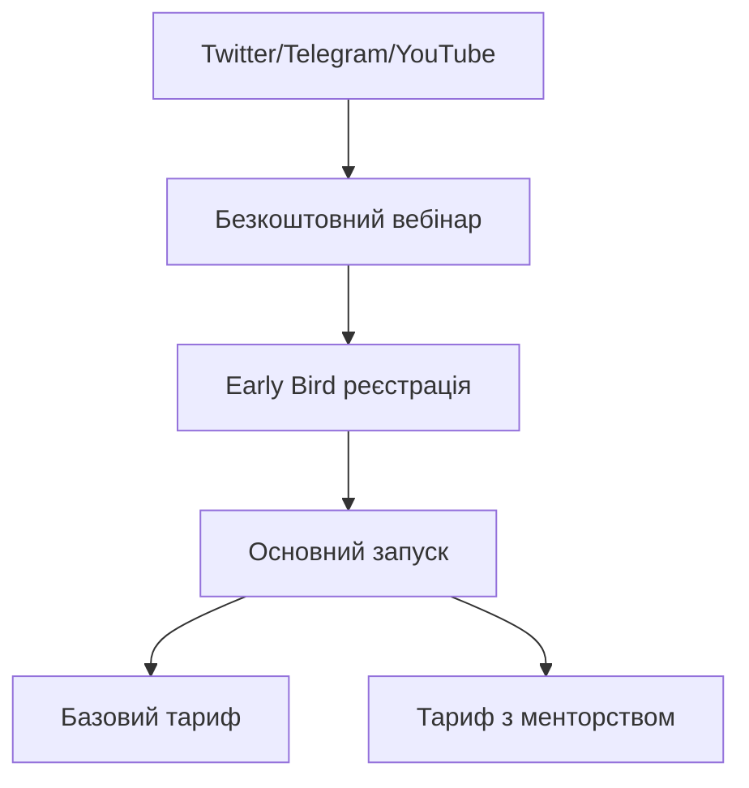
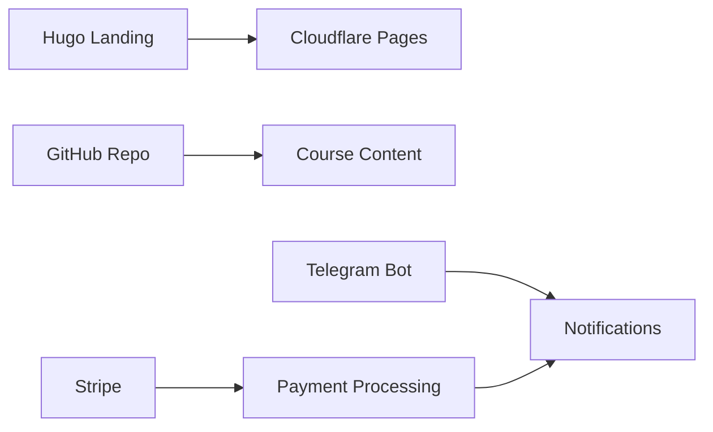

Мав дзвінок із Максом щодо курсу. Годину обговорювали аудиторію, платіжки, інфраструктуру. Granola записала все, витягнула структурований конспект. І тут я завис.

Куди це покласти?

Контекст має бути версіонований. Має бути читабельний для агента через API. І має бути таким, щоб я міг сказати Claude Code "прочитай контекст проєкту" — і він зрозумів.

## Варіанти, які я перебрав

**docs/ у репозиторії.** Логічно, але кожна зміна — це коміт. Контекст проєкту змінюється часто. Замусорювати історію комітами типу "update project context" — не хочу.

**GitHub Wiki.** Окремий клон. Окремий воркфлоу. Агент не може нормально з ним працювати через `gh` CLI. Відпадає.

**Notion.** API є, але воно незручне для агентів. Потрібен токен, складна структура запитів, пагінація. Для одного файлу з контекстом — overkill.

**README.** Вже захаращений. Додати туди ще й контекст проєкту — і його ніхто не читатиме.

## Що порадив Claude Code

Скопіював конспект із Granola в Claude Code і попросив дослідити best practices. Запустив на Opus 4.5 — і він зробив три паралельні пошуки через Exa:

1. Документація GitHub щодо project management
2. Knowledge management для невеликих команд
3. GitHub Projects для маленьких проєктів

Знайшов патерн ADR (Architecture Decision Records). Цікаво, але для контексту проєкту — надто формально.

## Порівняння

Агент порівняв три підходи:

| Підхід | Читання агентом | Оновлення | Для малих команд |
|--------|----------------|-----------|-----------------|
| `docs/PROJECT.md` | `cat docs/PROJECT.md` | потрібен коміт | нормально |
| Pinned Issue | `gh issue view` | `gh issue edit` | ідеально |
| GitHub Wiki | клон потрібен | окремий пуш | незручно |

Pinned Issue переміг. Причини прості:

- `gh issue view` — одна команда для читання
- `gh issue edit` — одна команда для оновлення
- Не засмічує історію комітів
- Коментарі працюють як changelog
- Можна чіпляти лейбли, діаграми, чеклісти

## Як це виглядає

Агент створив усе за хвилину. Ось що він зробив:

Створив лейбл:

```bash
gh label create "context" --description "Project context" --color 0E8A16
```

Створив issue зі структурованим контекстом:

```bash
gh issue create --title "Project Context" --label "context" --body "$(cat <<'EOF'
## Аудиторія
- Розробники рівня middle+
- Хочуть навчитися працювати з AI-агентами
- Географія: Україна, Польща, remote

## Курс
- Формат: 6 тижнів, live-сесії + записи
- Мова: українська
- Платформа: власний сайт + GitHub repo для домашок

## Маркетинг
- Канали: Twitter/X, Telegram, YouTube
- Лід-магніт: безкоштовний вебінар
- Воронка: вебінар → early bird → основний запуск

## Платежі
- Stripe для міжнародних
- Monobank для українських карток
- Два тарифи: базовий і з менторством

## Інфраструктура
- Hugo для лендінгу
- GitHub для контенту курсу
- Cloudflare Pages для хостингу
- Telegram бот для нотифікацій
EOF
)"
```

Закріпив issue:

```bash
gh issue pin 1
```

Потім додав коментар із чотирма mermaid-діаграмами — воронка продажів, технічна архітектура, стек учасника, контент-пайплайн:

```bash
gh issue comment 1 --body "$(cat <<'EOF'
## Воронка



## Технічна архітектура


EOF
)"
```

Одна хвилина. Структурований контекст проєкту, закріплений в репозиторії, доступний будь-якому агенту.

## Як я це використовую

На початку сесії:

```
Read project context from GitHub Issues
```

Claude Code виконує `gh issue view 1` і має повний контекст. Знає про аудиторію, стек, платіжну систему. Не треба нічого пояснювати.

Коли щось змінюється:

```
Update project context — ми підключили Stripe і обрали два тарифи
```

Агент оновлює issue через `gh issue edit` або додає коментар. Контекст актуальний. Історія змін видна.

Конкретніший приклад. Після дзвінка я кажу:

```
Ми вирішили робити курс українською замість англійської.
Додали Monobank як платіжний метод для України.
Онови контекст проєкту.
```

Агент читає поточний issue, оновлює відповідні секції, і все. Наступна сесія — вже з актуальним контекстом.

## Що працює добре

Pinned Issue — це по суті єдине джерело правди для проєкту. Кожен агент, кожна сесія починає з одного місця. Немає розсинхрону між тим, що в голові, і тим, що знає агент.

Mermaid-діаграми в коментарях — окремий кайф. GitHub рендерить їх нативно. Агент може генерувати нові діаграми при зміні архітектури.

Лейбл `context` дозволяє мати кілька контекстних issues. Один для проєкту в цілому, інший для спринту, третій для технічного боргу.

## Головний мінус

Треба привчити себе казати "онови контекст" замість того, щоб просто розмовляти з агентом. Це звичка. Після дзвінка, після рішення, після зміни планів — "онови контекст".

Якщо цього не робити, контекст застаріває. І тоді агент працює з неактуальною інформацією, що гірше, ніж не мати контексту взагалі.

Але якщо привчитися — це змінює все. Агент перестає бути інструментом, який треба щоразу вводити в курс справи. Він стає учасником проєкту, який знає, що відбувається.

## Підсумок

GitHub Issues — це не тільки баг-трекер. Pinned Issue з лейблом `context` — простий і ефективний спосіб зберігати контекст проєкту так, щоб і люди, і агенти мали до нього доступ.

Одна команда для читання. Одна для оновлення. Без зайвих комітів, без сторонніх сервісів, без складних API.

```bash
# Прочитати контекст
gh issue view 1

# Оновити контекст
gh issue edit 1 --body "новий контекст"

# Додати зміну як коментар
gh issue comment 1 --body "Підключили Stripe, обрали два тарифи"
```

Просто працює.
